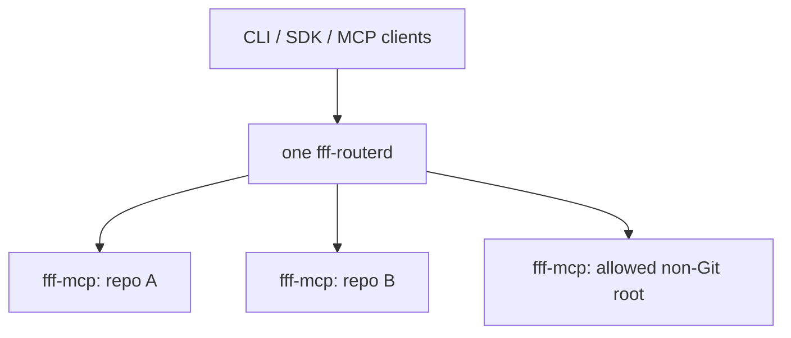

# fff-router

`fff-router` is a machine-local routing layer for [FFF](https://github.com/dmtrKovalenko/fff). One per-user `fff-routerd` daemon owns a bounded pool of warm `fff-mcp` child processes—one process and index per repository root—and shares those workers across CLIs, MCP clients, Prime Agent extensions, and Pi extensions.

Version 1 deliberately supports one backend: upstream `fff-mcp`. There is no embedded `fff-node`, `rg` fallback, backend selector, or legacy wrapper API.

## Install from GitHub

Node.js 22 or newer is required. Corepack pins the repository to pnpm 11.19.0; aube can also consume the committed pnpm lockfile for development workflows.

```sh
corepack pnpm@11.19.0 add --global github:unstableneutron/fff-router
fff setup
```

If pnpm's global home is not configured yet, run `corepack pnpm@11.19.0 setup` once and start a new shell before installing. In a disposable or non-interactive shell, configure it without editing a shell profile:

```sh
export PNPM_HOME="${XDG_DATA_HOME:-$HOME/.local/share}/pnpm"
export PATH="$PNPM_HOME/bin:$PATH"
corepack pnpm@11.19.0 add --global github:unstableneutron/fff-router
fff setup
```

With aube already installed, `aube add --global github:unstableneutron/fff-router` is the supported alternative. `fff update` uses the same priority: Corepack/pnpm, aube, then a standalone pnpm.

`fff setup` downloads the latest compatible upstream `fff-mcp` release, verifies its SHA-256 checksum, installs it under `~/.local/bin` by default, and starts `fff-routerd`. The router discovers that managed binary even if `~/.local/bin` is not on `PATH`.

To use an existing binary instead:

```sh
export FFF_ROUTER_FFF_MCP_BIN=/absolute/path/to/fff-mcp
fff doctor
```

## CLI

```sh
# Fuzzy file/path search
fff find router --within .
fff find coordinator -w packages/api -e ts -e tsx --json

# Literal content search (the default)
fff grep createRouterService -w . -C 2

# Explicit regular expression search
fff grep 'create(Router|Worker)' --regex -w lib --json

# Prewarm one worker/index per discovered repository root
fff warm ~/src/project-a ~/src/project-b

# Inspect and manage the shared pool
fff status
fff evict ~/src/project-a
fff doctor

# Daemon lifecycle
fff daemon start
fff daemon reload
fff daemon restart
fff daemon stop
fff daemon logs
```

Run `fff --help` for all options. Human output preserves upstream FFF's compact rendering where possible. `--json` always emits the normalized v1 schema.

### Exit codes

| Code | Meaning                                    |
| ---: | ------------------------------------------ |
|  `0` | Success                                    |
|  `1` | Runtime, daemon, worker, or search failure |
|  `2` | Invalid CLI usage                          |

## TypeScript SDK

Install the package in a Prime Agent or Pi extension and import the high-level client:

```ts
import { getRouterClient } from "fff-router";

const fff = await getRouterClient({ cwd: process.cwd() });

const files = await fff.findFiles({
  query: "router",
  within: ".",
  extensions: ["ts"],
  limit: 20,
});

if (!files.ok) {
  throw new Error(`${files.error.code}: ${files.error.message}`);
}

for (const hit of files.value.items) {
  console.log(hit.absolutePath);
}
```

The SDK resolves relative and home-relative `within` paths in the caller process before sending an absolute wire request. `getRouterClient()` keeps a process-global connection singleton, so multiple extension modules do not create duplicate HTTP clients or daemons.

Available package exports:

| Export                | Intended use                                                       |
| --------------------- | ------------------------------------------------------------------ |
| `fff-router`          | High-level client, normalized request/result types, and schemas    |
| `fff-router/client`   | `RouterClient`, `connectRouter`, and client input types            |
| `fff-router/protocol` | Canonical Zod v4 input/output schemas and request normalization    |
| `fff-router/server`   | Daemon, worker pool, adapter, and service primitives for embedding |

An embedding can run the same server implementation directly:

```ts
import { startHttpDaemon } from "fff-router/server";

const daemon = await startHttpDaemon();
// await daemon.close();
```

## MCP hosts

`fff mcp` is a stdio bridge to the already shared daemon. Configure it as one MCP server instead of launching one upstream `fff-mcp` per repository or host session:

```json
{
  "mcpServers": {
    "fff": {
      "command": "fff",
      "args": ["mcp"]
    }
  }
}
```

The MCP tools are:

- `find_files`
- `grep`
- `router_status`
- `router_warm`
- `router_evict`

Search tools require absolute `within` paths on the MCP wire. SDK and CLI callers may use relative paths because they have a well-defined caller working directory.

## Normalized v1 schema

Zod v4 is the single input-schema source for the SDK normalization and MCP JSON Schema. Public names are camelCase, while MCP tool names retain upstream-compatible snake case.

```ts
type FindFilesInput = {
  query: string;
  within: string | string[];
  glob?: string;
  extensions?: string[];
  excludePaths?: string[];
  limit?: number; // 1..50
  cursor?: string | null;
};

type GrepInput = {
  patterns: string[]; // 1..20, OR semantics
  literal?: boolean; // true by default
  contextLines?: number; // 0..5
  within: string | string[];
  glob?: string;
  extensions?: string[];
  excludePaths?: string[];
  limit?: number;
  cursor?: string | null;
};
```

A successful result has one stable shape. The SDK validates daemon responses with the exported Zod schemas before returning them to callers:

```ts
type SearchResult = {
  tool: "find_files" | "grep";
  root: string;
  backend: "fff-mcp";
  items: Array<{
    path: string; // relative to root
    absolutePath: string;
    line?: number;
    text?: string;
    column?: number;
    contextBefore?: string[];
    contextAfter?: string[];
    isDefinition?: boolean;
    definitionBody?: string[];
  }>;
  nextCursor: string | null;
  stats: {
    resultCount: number;
    upstreamShownCount?: number;
    upstreamTotalCount?: number;
    coldStart: boolean;
    workerId: string;
    workerGeneration: number;
  };
  readRecommendation?: {
    path: string;
    absolutePath: string;
    reason?: string;
  };
  displayText?: string;
};
```

`resultCount` is the number of normalized items actually returned. The optional
`upstream*` counts preserve `fff-mcp`'s pre-filter summary and may therefore be larger.

Router cursors wrap upstream cursors and bind them to the repository, complete search request, and worker generation. A cursor cannot be reused with a different query or root, and it expires clearly if its worker restarts. This prevents upstream's worker-local cursor IDs from silently restarting at page one.

There is no public `caseSensitive` option: upstream `fff-mcp` owns its smart-case behavior, and the router does not advertise a switch it cannot faithfully implement.

## Process and index model



- Git-backed requests route to the discovered Git root.
- Non-Git requests are denied unless they are under a configured allowlist; each first child below an allowlist entry becomes an isolated worker root.
- Concurrent cold requests for one root share the same startup promise.
- Every call holds a worker lease. TTL, LRU, explicit eviction, reload, and capacity enforcement drain a busy worker and close it only after its final lease releases.
- Unexpected exits and startup failures are diagnosed and restarted with backoff.
- A stale transport or timed-out first-page call gets one fresh-worker retry. Cursor calls are not replayed across workers.

The adapter intentionally retains a bounded parser for upstream `fff-mcp`'s compact text output because the upstream project is outside this repository's control. Parsing, path filtering, and compact-text rewriting live together in `adapters/fff-mcp-stdio.ts`; everything above the adapter uses normalized structured objects.

## Configuration

The daemon creates `~/.config/fff-routerd/config.json` on first use, or
`$XDG_CONFIG_HOME/fff-routerd/config.json` when `XDG_CONFIG_HOME` is set:

```json
{
  "host": "127.0.0.1",
  "port": 4319,
  "mcpPath": "/mcp",
  "allowlist": [],
  "warmRoots": [],
  "ttl": {
    "gitMs": 3600000,
    "nonGitMs": 900000
  },
  "limits": {
    "maxWorkers": 12,
    "maxNonGitWorkers": 4
  },
  "runtime": {
    "toolTimeoutMs": 30000,
    "sweepIntervalMs": 30000,
    "restartBackoffMs": 1000
  }
}
```

`config.jsonc` is also accepted when `config.json` does not exist. Unknown fields—including the removed `backend` field—are rejected. Sending `SIGHUP` or running `fff daemon reload` applies reloadable worker policy. `SIGUSR2` reloads configuration and drains all workers.

The HTTP daemon is intentionally machine-local and refuses non-loopback bind addresses. MCP requests also require a random bearer capability stored in the per-user state directory with mode `0600`; unauthenticated health checks reveal only daemon compatibility metadata, not worker roots. `fff mcp` is a stateless stdio facade over that same authenticated loopback endpoint, so it does not require a Unix socket or named pipe. Do not treat routing policy as an OS sandbox: the daemon can search files readable by its user inside permitted roots.

## Breaking changes from 0.x

- Removed `@ff-labs/fff-node` and the `rg`/`fd` adapter path.
- Removed backend and fallback configuration.
- Removed `fff-find-files` and `fff-grep`; use `fff find` and `fff grep`.
- Removed legacy `fff_*` public tool names and compatibility output modes.
- Removed `search_terms`; use literal `grep` with multiple patterns.
- Removed the ineffective explicit case-sensitivity option.
- Replaced snake_case result fields with one camelCase structured schema.
- Replaced split lifecycle/runtime registries with one lease-safe `WorkerPool`.

## Development

```sh
corepack pnpm install --frozen-lockfile
corepack pnpm test
corepack pnpm run check
corepack pnpm run build
corepack pnpm pack
```

`pnpm run build` bundles the two executables and public JavaScript entrypoints, then emits TypeScript declarations for every exported SDK surface.
