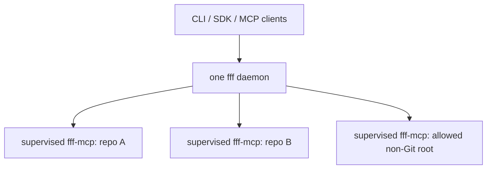

# fff-router

`fff-router` is a machine-local routing and supervision layer for
[FFF](https://github.com/dmtrKovalenko/fff). One per-user daemon owns a bounded pool of
warm `fff-mcp` child processes—one process and index per repository root—and shares them
across the CLI, TypeScript SDK, direct HTTP MCP clients, and stdio MCP hosts.

Version 2 has one backend (`fff-mcp`), no runtime npm dependencies, and a public MCP
boundary targeting the stateless `2026-07-28` specification. The upstream worker still
speaks its older stdio MCP revision; that compatibility handshake and compact-text parser
are isolated in the worker adapter.

## Install

### Native CLI and daemon

Tagged releases build one self-contained Perry executable for:

- macOS Apple Silicon (`fff-darwin-arm64`)
- Linux ARM64 (`fff-linux-arm64`)
- Linux x86-64 (`fff-linux-x64`)

The same executable is both the CLI and daemon. A native CLI auto-starts itself with the
hidden `__daemon` mode, so Node.js and a separate `fff-routerd` binary are not required.
Run `fff setup` once after installing it; setup downloads the matching upstream `fff-mcp`
binary and verifies its SHA-256 checksum. Native setup uses the platform `curl` command
(included with macOS; install it with your Linux package manager if absent) through a
deadline-bound, status-file adapter because Perry 0.5.1220 does not reliably deliver one-shot
child exit callbacks. The TypeScript package uses bounded built-in fetch.

### TypeScript SDK / Node CLI

Node.js 22 or newer is required for the package build and SDK. Corepack pins pnpm:

```sh
corepack pnpm@11.19.0 add --global github:unstableneutron/fff-router
fff setup
```

If pnpm's global home is not configured, run `corepack pnpm@11.19.0 setup` once. `aube add
--global github:unstableneutron/fff-router` is also supported. `fff update` prefers
Corepack/pnpm, then aube, then a standalone pnpm.

To use an existing worker binary:

```sh
export FFF_ROUTER_FFF_MCP_BIN=/absolute/path/to/fff-mcp
fff doctor
```

## CLI

```sh
# Fuzzy file/path search
fff find router --within .
fff find coordinator -w packages/api -e ts -e tsx --json

# Literal content search (default) or explicit regex
fff grep createRouterService -w . -C 2
fff grep 'create(Router|Worker)' --regex -w lib --json

# Pool management
fff warm ~/src/project-a ~/src/project-b
fff status
fff evict ~/src/project-a
fff doctor

# The daemon starts the authenticated HTTP MCP endpoint too
fff daemon start
fff daemon reload
fff daemon restart
fff daemon stop
fff daemon logs
```

Human output preserves upstream FFF's compact rendering where possible. `--json` emits the
normalized v2 result schema. Exit code `0` is success, `1` is a runtime failure, and `2` is
invalid CLI usage.

## TypeScript SDK

Extensions should import the client, not the worker pool. That preserves one shared daemon
and one warm index per root:

```ts
import { getRouterClient } from "fff-router";

const fff = await getRouterClient({ cwd: process.cwd() });
const files = await fff.findFiles({
  query: "router",
  within: ".",
  extensions: ["ts"],
  limit: 20,
});

if (!files.ok) throw new Error(`${files.error.code}: ${files.error.message}`);
for (const hit of files.value.items) console.log(hit.absolutePath);
```

The SDK resolves relative and home-relative scopes in the caller before sending absolute
paths over the wire. `getRouterClient()` keeps one process-global client per endpoint.

| Export                | Intended use                                                       |
| --------------------- | ------------------------------------------------------------------ |
| `fff-router`          | High-level client, normalized types, and static schemas            |
| `fff-router/client`   | `RouterClient`, `connectRouter`, and client input types            |
| `fff-router/protocol` | JSON Schema 2020-12 plus dependency-free runtime validators        |
| `fff-router/server`   | Daemon, supervisor pool, adapter, and service embedding primitives |

## MCP access

Running `fff daemon start` starts the generic HTTP MCP endpoint at
`http://127.0.0.1:4319/mcp` by default. It is not coupled to `fff mcp`.

The endpoint implements stateless MCP `2026-07-28`:

- no `initialize`, session ID, GET stream, or DELETE lifecycle;
- `server/discover` is implemented;
- every request carries protocol version and client capabilities in `_meta`;
- HTTP requests require `MCP-Protocol-Version`, `Mcp-Method`, and, for tool calls,
  `Mcp-Name`;
- successful results include `resultType: "complete"`;
- Origin validation and a random per-user bearer capability protect the loopback endpoint.

The SDK reads the capability automatically. A direct HTTP request looks like:

```http
POST /mcp HTTP/1.1
Host: 127.0.0.1:4319
Authorization: Bearer <contents of ~/.local/state/fff-routerd/auth-token>
Content-Type: application/json
Accept: application/json, text/event-stream
MCP-Protocol-Version: 2026-07-28
Mcp-Method: tools/call
Mcp-Name: find_files

{"jsonrpc":"2.0","id":1,"method":"tools/call","params":{"name":"find_files","arguments":{"query":"router","within":"/absolute/repo"},"_meta":{"io.modelcontextprotocol/protocolVersion":"2026-07-28","io.modelcontextprotocol/clientInfo":{"name":"example","version":"1"},"io.modelcontextprotocol/clientCapabilities":{}}}}
```

`fff mcp` exposes the same modern contract over stdio for hosts that prefer a command-based
MCP configuration:

```json
{
  "mcpServers": {
    "fff": { "command": "fff", "args": ["mcp"] }
  }
}
```

Available tools are `find_files`, `grep`, `router_status`, `router_warm`, and
`router_evict`. MCP wire scopes must be absolute; SDK and CLI scopes may be relative.

## Normalized protocol

Inputs and outputs use one dependency-free TypeScript contract. Runtime validators and
JSON Schema are defined together in `public-api.ts`; there is no AJV, Zod, Proxy, eval, or
runtime-generated validator in the native module graph.

```ts
type FindFilesInput = {
  query: string;
  within: string | string[];
  glob?: string;
  extensions?: string[];
  excludePaths?: string[];
  limit?: number; // 1..50
  cursor?: string | null;
};

type GrepInput = {
  patterns: string[]; // 1..20, OR semantics
  literal?: boolean; // true by default
  contextLines?: number; // 0..5
  within: string | string[];
  glob?: string;
  extensions?: string[];
  excludePaths?: string[];
  limit?: number;
  cursor?: string | null;
};
```

Successful searches contain a root, normalized items, an opaque router cursor, and stats
including `coldStart`, `workerId`, and `workerGeneration`. Cursors are bound to the root,
complete query, and worker generation; they expire instead of silently replaying against a
restarted index.

## Process model and supervisor



Each worker is launched in its own process group on Linux and macOS. The supervisor:

- deduplicates concurrent cold starts and holds active-call leases;
- samples RSS, cumulative CPU time, and process/thread counts (including descendants through
  `/proc` on Linux);
- terminates a worker after two consecutive per-worker RSS violations;
- evicts the largest idle workers when aggregate sampled RSS exceeds its cap;
- bounds stdout messages and retained stderr diagnostics;
- turns tool timeouts and malformed/closed transports into worker invalidation;
- closes stdin, then escalates to process-group `SIGTERM` and `SIGKILL`;
- applies capped exponential restart backoff and bounded dead-worker history;
- gives upstream `fff-mcp` a nonzero idle timeout as an orphan failsafe.

`fff status --json` reports each PID, generation, lease count, last activity/error,
termination reason, and last resource sample. It also separates daemon RSS, worker RSS, and
their measured total. Sampling and RSS caps are supervisor-enforced soft limits, not kernel
quotas. For hostile workloads, add an OS boundary such as a cgroup/systemd unit on Linux or
a launchd/container policy on macOS.

The daemon exits after 30 minutes without an active request by default, closing all worker
groups first. Any CLI/SDK/MCP request resets that timer. Set `daemonIdleTimeoutMs` to `0` to
keep it resident. Autostart is transparent, so a later request starts it again.

## Configuration

The daemon creates `~/.config/fff-routerd/config.json`, or
`$XDG_CONFIG_HOME/fff-routerd/config.json`:

```json
{
  "host": "127.0.0.1",
  "port": 4319,
  "mcpPath": "/mcp",
  "allowlist": [],
  "warmRoots": [],
  "ttl": {
    "gitMs": 3600000,
    "nonGitMs": 900000
  },
  "limits": {
    "maxWorkers": 12,
    "maxNonGitWorkers": 4,
    "maxWorkerRssBytes": 805306368,
    "maxTotalWorkerRssBytes": 2147483648
  },
  "runtime": {
    "toolTimeoutMs": 30000,
    "sweepIntervalMs": 30000,
    "restartBackoffMs": 1000,
    "restartBackoffMaxMs": 60000,
    "processSampleIntervalMs": 5000,
    "processShutdownGraceMs": 500,
    "processKillGraceMs": 1000,
    "workerOrphanIdleTimeoutMs": 1800000,
    "daemonIdleTimeoutMs": 1800000
  }
}
```

Non-Git requests are denied unless they fall under an allowlist entry; each first child
below an entry becomes an isolated root. The daemon refuses non-loopback binds. Config is
polled portably and can also be applied immediately over the authenticated control endpoint
with `fff daemon reload`; `fff daemon reload --clear-runtimes` reloads and drains all workers.
POSIX signals remain a foreground-runtime fallback, but are not the cross-runtime control
contract. Routing policy is cooperative protection, not an OS filesystem sandbox: the
processes retain their user's normal file permissions.

## Native development and release

Perry is pinned as a dev dependency and strict mode rejects eval, runtime-computed imports,
and recognized-but-unimplemented Node APIs:

```sh
corepack pnpm install --frozen-lockfile
corepack pnpm check:perry
corepack pnpm build:native
```

Native builds also require Git, Rust/Cargo 1.88.0, and Clang (or Xcode Command Line Tools
on macOS). Linux build hosts need `libssl-dev`. The published Perry 0.5.1220
platform package does not include the native HTTP/net wrapper archives used by this daemon,
so the build script fetches its exact source revision
`06137858dc8c6f80975238377138f2f948d6ef88` and lets Perry build a source-matched runtime.
Both that checkout and Cargo outputs are cached below `dist/native/`; set
`PERRY_WORKSPACE_ROOT` to an existing checkout at that revision to supply it explicitly.

`build:native` compiles `bin/fff.ts`, emits a native provenance attestation, and supports
`--target linux`, `--target linux-aarch64`, and `--target macos`. macOS artifacts are built
on Apple Silicon runners; Linux x64 and ARM64 use their corresponding Linux runners. CI
runs type/lint/test/package checks plus all three native builds. A `v*` tag publishes the
binaries, attestations, and SHA-256 files to a GitHub Release.

The native executable still launches the separate upstream static `fff-mcp` worker. This
keeps upstream indexing behavior intact while removing Node/V8 from the router and CLI.
The native worker transport uses standard POSIX `/bin/sh`, `mkfifo`, `mv`, and `rm`
utilities, which are present by default on the supported macOS and Linux release hosts.

## Development

```sh
corepack pnpm install --frozen-lockfile
corepack pnpm check
corepack pnpm test
corepack pnpm build
FFF_ROUTER_FFF_MCP_BIN=/path/to/fff-mcp corepack pnpm smoke:live -- .
corepack pnpm pack
```

`pnpm build` bundles the Node CLI and public SDK entrypoints and emits TypeScript
declarations. `smoke:live` drives the modern HTTP boundary through a real upstream worker
and asserts that find and grep reuse one worker generation.
